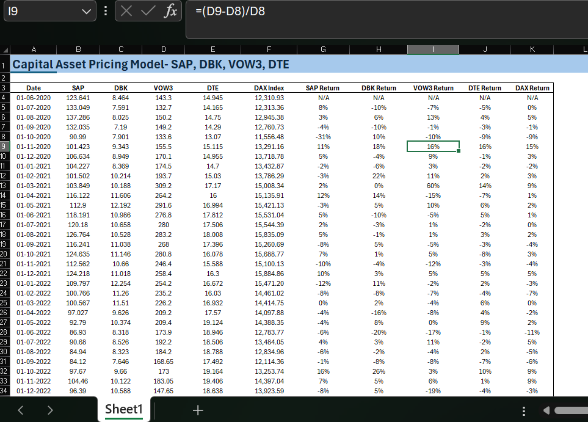
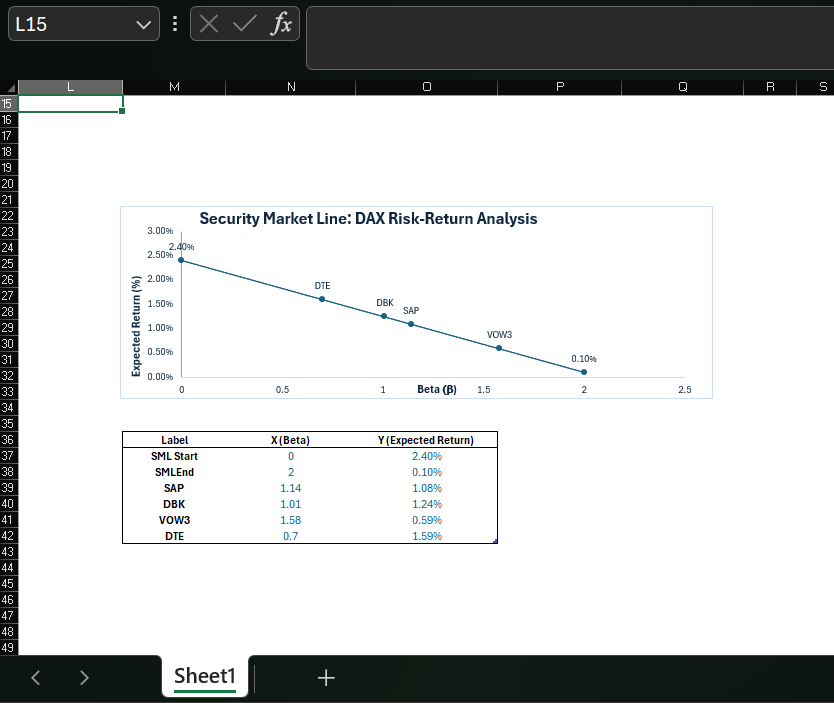
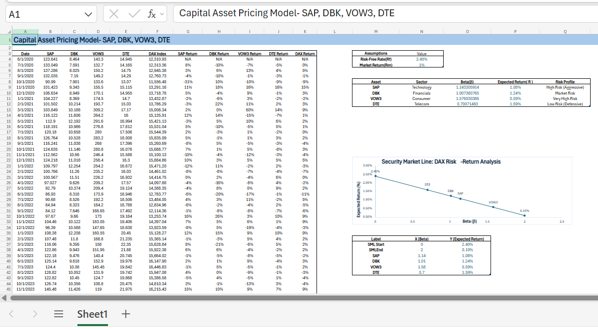

# Quantitative Risk Analysis & CAPM Modeling: DAX Constituents
**Strategic Equity Research | Systematic Risk Assessment | European Equity Markets**

## 📌 Project Objective
The primary objective of this study is to quantify the **systematic risk ($\beta$)** and **expected returns** for a diversified selection of DAX-listed companies: **SAP**, **Deutsche Bank**, **Volkswagen**, and **Deutsche Telekom**. By isolating market sensitivity from idiosyncratic volatility, this model provides a data-driven framework for asset categorization and valuation relative to the German market benchmark.

---

## 🛠 Methodology & Analysis Process
The analysis was executed entirely within **Microsoft Excel**, following a rigorous quantitative workflow:

1. **Data Synthesis:** Historical monthly adjusted closing prices (2020–2024) were sourced via **Yahoo Finance** and validated against **Deutsche Börse** records.
2. **Data Transformation:** Leveraged Excel formulas to calculate logarithmic monthly returns and excess returns over the Risk-Free Rate ($R_f$).
3. **Statistical Modeling:** - Conducted **OLS Regression Analysis** using the *Data Analysis Toolpak* to derive Beta coefficients.
    - Implemented the **CAPM Equation**: $E(R_i) = R_f + \beta_i(E(R_m) - R_f)$.
4. **Visualization:** Developed dynamic dashboards and a **Security Market Line (SML)** plot to visually represent risk-adjusted performance.

### Core Assumptions
- **Risk-Free Rate ($R_f$):** Based on localized **10-Year German Bund** yields (approx. 2.4%).
- **Market Efficiency:** Assumes semi-strong market efficiency where investors are rational and diversified.

---

## 📊 Dashboard & Visual Findings

### 1. Cumulative Performance Dashboard
This dashboard tracks the normalized price action of the constituents against the DAX Index to visualize relative strength.

### 2. The Security Market Line (SML)
The SML plot identifies the equilibrium between risk and return. 

*Securities plotted above the SML represent undervalued assets with positive Alpha ($\alpha$), while those below indicate overvaluation relative to their risk profile.*

---

## 📈 Key Findings & KPIs
The model yielded the following strategic insights based on the 2020–2024 data window:

* **Risk Polarization:** **SAP** and **Deutsche Bank** exhibited high Beta coefficients (> 1.0), marking them as aggressive growth assets highly sensitive to Eurozone economic cycles.
* **Defensive Stability:** **Deutsche Telekom** maintained a Beta significantly below 1.0, confirming its status as a defensive utility play with capital preservation characteristics.
* **Market Equilibrium:** **Volkswagen** demonstrated a Beta near 1.0, indicating its performance moves in tandem with the broader DAX index.
* **Sector Analysis:** The analysis explores how industry-specific factors—such as ECB interest rate pivots—influence systemic risk exposure within the Eurozone framework.

---

## 📂 Repository Contents
* **`CAPM.xlsx`**: Full Excel model including regression outputs and interactive charts.
* **`CAPM_Data.csv`**: Cleaned dataset of historical DAX constituent prices used for the model.
* **`visuals`**: High-resolution exports of the SML Plot and Performance Dashboards.

---

## 💻 Software Requirements
- **Microsoft Excel** (2019 or later recommended)
- **Excel Data Analysis Toolpak** (Enabled for OLS Regression)
- **Power Query** (For data cleaning and transformation)

---

**Keywords:** `Quantitative-Finance` `CAPM` `Equity-Research` `Beta-Analysis` `SML` `Financial-Modeling` `DAX-Index` `Regression-Analysis`
